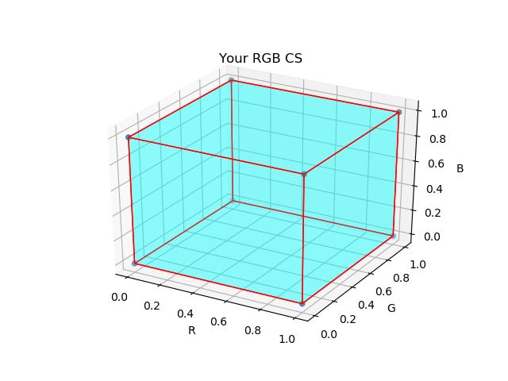
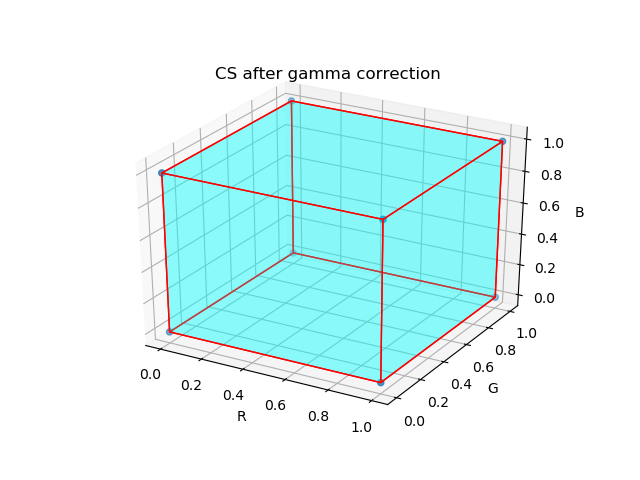
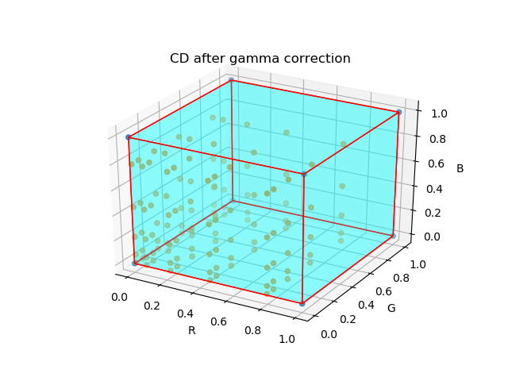
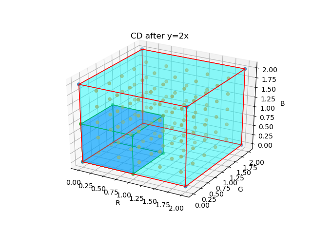
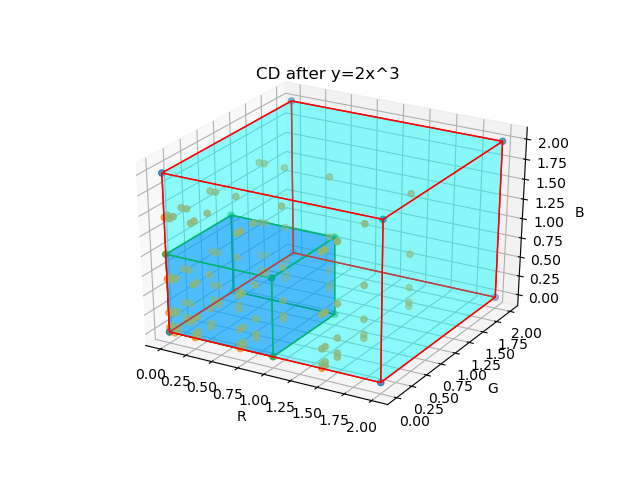
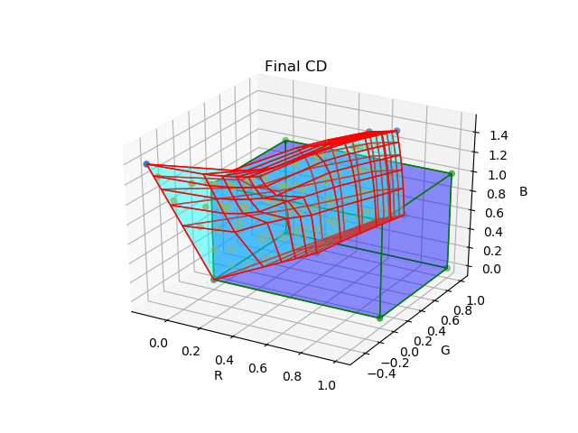
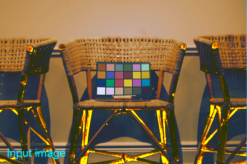

## 拟合过程

上图是关于拟合过程的流程图。图中的方框是代表的是色彩数据，而方框的内容指的是该色彩数据所处的色彩空间，其中CS是Color Space的缩写。箭头代表着数据在各色彩空间中流动的方向，箭头标示了色彩空间变换所用的方法。蓝色代表着测量数据，而绿色代表着参考数据。

### 测量数据

左上角的方框代表着测量数据，该数据由R, G, B三个通道构成。由于测量设备未标定，因此输入数据处于相对色彩空间中，而拟合的目的便是建立该相对色彩空间与绝对色彩空间之间的关系。

整个拟合过程所有的RGB色彩空间数值都必须做归一化，即取值在[0, 1]之间。

### 线性化

对测量数据的第一步操作便是将其线性化。测量数据可能由于测量系统的物理机制或者为了适应人眼的习惯等原因与亮度存在非线性关系，如果不将其线性化，无法有效的用线性变换近似线性化的绝对色彩空间。只有相对色彩空间和绝对色彩空间的数值与亮度均成正比关系，才能使用线性变换近似两者之间的色彩转换。

由于测量色彩空间尚未标定，因此它不能直接使用绝对色彩空间如sRGB, Adobe RGB的线性化过程。除非完全掌握测量过程的物理机制，否则我们只能采用一些经验的方式来进行线性化。经验上通常采用的线性化有这么几种。一是使用gamma校正，gamma值通常设为2.2，也可以自定义。二是使用多项式拟合，为了防止过拟合，拟合的次数通常不超过3，具体拟合方法又能细分成好几种。第三种是恒等变换，即不做任何改变。对于RAW格式的测量数据，因其已是线性数据，因此使用恒等变换即可。具体程序使用的线性化方式会另文进行介绍。

### CCM矩阵

测量数据线性化后，通过线性变换将其近似的转成某个线性的绝对RGB色彩空间。进行线性变换等价于乘以一个矩阵，而这个矩阵我们称为CCM矩阵（color correction matrix）[1]。CCM矩阵也是我们进行拟合的目标。我们可以设定进行线性变换后转成的具体色彩空间，如Linear sRGB，Linear Adobe RGB等。图中的Set 1便是设置色彩空间的位置。通常情况下，该色彩空间需和你想最终保存数据的色彩空间一致，以减少推断过程中色彩空间的换算。

CCM矩阵的形状通常$3\times3$和$4\times3$两种。前者对色彩的数值进行线性变换，而后者做仿射变换。换言之，色彩空间在前者的变换后保持原点不变，而后者可以发生平移。可见，$3\times3$的CCM矩阵的变换集合是$4\times3$的真子集，这意味着使用$4\times3$CCM矩阵拟合的解集更大。然而，最新的论文更愿意使用$3\times3$的CCM矩阵而非后者。

### 色彩距离

当测量数据转换成绝对色彩空间时，我们需要评估转换后的结果是否与参考值接近。评估使用的函数称为损失函数，我们需要找到合适的CCM的值，以尽可能的降低损失函数的大小。而损失函数通常设定为所有测量数据与参考数据对应颜色差值的加权平方和，因此要计算损失函数，我们要计算颜色的差值。颜色差值[2]通用的标准是CIE76，CIE94和CIEDE2000以及CMC等标准，这些标准都是建立在CIE lab色彩空间的基础上的，因此我们通常需要将线性变换后的色彩空间转换成CIE lab色彩空间，以便计算距离。当然，我们也可以使用非标准的距离方程，如直接使用设定的绝对RGB色彩空间的欧拉距离，或是设定的线性化的绝对RGB色彩空间的欧拉距离。前者可能在机器视觉上有少量应用，而后者由于计算方便，可以作为测试或是生成使用其他距离方程时的拟合的初始值。我们在Set 2的位置可以设置具体的距离公式。

因此，在线性变换之后，我们需要将将色彩空间转换成CIE lab色彩空间。由于只有指定白点，CIE lab空间才能被真正确立下来。我们假设白点为标准光源，并用标准光源类型和标准观察者（后面将简写成IO，Illuminant and Observer）来指定具体的标准光源。尽管具体公式本身不需要确定CIE lab空间，也即是说，不需要指定IO值，但只有在指定IO值下，指定的线性化绝对RGB色彩空间与CIE LAB色彩空间的转换关系才能确立下来。因此在Set 2设置中如果选择CIE lab相关的距离公式，同时还需要设定IO值，以便于色彩空间的正确转换。为了与后面设置的IO值区别开来，此处设置的IO值称为IO_1。

于此同时，参考数据也需要转换到距离公式所对应的色彩空间中。由于参考数据本身处于绝对色彩空间中，因此我们只需要直接进行色彩空间转换即可。也因此，我们除了要输入参数颜色值外，还要输入颜色值所处的色彩空间，如sRGB, CIE lab等。如果是CIE lab空间，我们同样需要IO值来确定色彩空间，以便于确定参考颜色的真实值。此处设置的IO称为IO_2。参考颜色和色彩空间确立了绝对的参考数据，我们称为色卡。由于同一张色卡可能用于多种设备的拟合，因此我们将色卡的色彩空间与Set 1的RGB色彩空间和Set 2的距离使用的色彩空间区别开来，以避免拟合前手动转换参考值的色彩空间到Set 1或Set 2所处的色彩空间。

### 非线性优化

#### 损失函数和比重

当测量数据和参考数据都转换成距离公式所处的色彩空间的时候，我们便可以计算色彩差值乃至损失函数。前文提到，损失函数通常设置为所有测量数据与参考数据对应颜色差值的加权平方和，而这个权重值通常有几种设置方法：一种是默认，则所有颜色差值的地位相等；第二种是等比与亮度的幂[1]，此处的亮度是颜色在CIE lab色彩空间中的l*分量；第三种是手动输入，这种更为灵活，但前提是使用者充分掌握色彩领域相关知识。所有的权重都将归一化，以便比较损失函数值。归一化并不会影响损失函数的收敛。

并非所有颜色都能参与到最终损失函数的计算。最大的排斥理由是饱和[1]。如果测量的某个颜色的R, G, B通道中有一通道达到或非常靠近最大值，很可能在这个通道发生了饱和。饱和的出现通常意味着该通道实际亮度可能被截断了，不能反映真实的值，无法被线性化。因此，需要将饱和的颜色去除，判定条件是其中任一通道发生了饱和。基于相同的理由，饱和通道也不能用于计算线性化过程的参数。

第二个排斥颜色的理由是色彩距离公式。通常情况下CIEDE2000标准被认为目前最接近人心理上的关于色彩距离的标准，然而CIEDE2000距离函数却不是连续函数[3]。针对某参考颜色的距离方程在a\*b\*平面上从原点出发远离颜色位置的方向附近会有较大的不连续性，因此，这个不连续性极易发生在很接近原点的色彩上，也就是黑白灰色。下图便是标准Macbeth色卡第19号颜色附近的等高线，该颜色是白色，可以明显的看到距离函数不连续的位置。在不连续位置附近，三角不等式也无法满足，准确的说，CIEDE2000距离函数并不是度量，不能称为距离函数。虽然断定这个不连续性会影响到损失函数的收敛过于武断，但我们提供了计算损失函数时排斥黑白灰色的选项，以期望通过提升损失函数的微分性质来更好的收敛损失函数。

#### 距离函数的影响

大部分情况下，我们使用非线性优化来计算CCM矩阵，最主要的原因是从指定的线性化RGB空间转换成色彩距离空间是个非线性的过程。但如果距离函数设定为linear RGB，那么这个转换过程变成identity变换，那么我们可以直接使用加权最小二乘法求得最优的CCM矩阵。这也提供了其他距离函数下非线性优化初值生成的一种方式，也是推荐的一种方式。另外一种是保持白平衡的初值方式。

如果距离函数被设定为CIE lab色彩空间，那么设定不同的RGB空间的最优化解本质上没有什么不同，是同一种颜色在不同色彩空间中的不同表达。其中的原因是各个linear RGB空间仅相差一个线性变换，在本文将其定义成LRCCM (Linear RGB Colorspace Conversion Matrix)。如果在Linear RGB I空间上CCM矩阵取值为$CCM_1$时达到收敛，收敛至某个颜色组C；那么在Linear RGB II上将CCM矩阵取为$(LRCCM_{II\to I})*CCM_1$时也会取到到颜色组C。如果Linear RGB II有更好的收敛矩阵$CCM_2$，能取得比C更好的颜色组C\*，那么取Linear RGB I空间上CCM的矩阵为$(LRCCM_{I\to II})*CCM_2$，则Linear RGB I空间获得比颜色组C更好的颜色组C\*，这与颜色组C为最优解矛盾。根据以上的简单推理，我们可以证明距离函数所属空间为CIE lab距离函数时，设定的RGB空间并没有本质区别。当然，由于RGB转换成CIE lab的函数非凸，因此这个非线性优化过程无法保证达到全局最优，使用不同的RGB空间很可能收敛到不同的局部最优的颜色组。

可能存在少量原因使用RGB色彩距离公式。此时由于linear RGB到RGB之间的转换对不同的RGB空间可能不一样，因此这时候设置不同的RGB空间会导致不同的收敛结果。

#### 优化方法

由于最常用的CIEDE2000的距离公式并不连续，因此不能采用基于导数的非线性优化方法。Nelder-Mead方法是最广泛使用的无导数非线性优化方法，我们也优先使用该方法作为非线性优化方法。如前所述，全局最优无法被保证，因此不同初始值的选用、不同RGB空间的选用都可能会收敛到不同的局部最优，即使是距离函数设置为CIE lab色彩空间。

拟合结束后我们可以对模型进行评估。虽然这部分可以在拟合完成后直接评估，但出于逻辑上的原因，将这部分内容放在推理过程部分之后。

## 推理过程

推理过程需要走和拟合过程相似的流程，但却简单的多。对于输入的图片，我们使用拟合时使用的线性化方式进行线性化，然后乘以CCM矩阵，此时数据已成为绝对的线性RGB色彩空间。一般情况下，我们需要将线性化RGB空间转换成RGB空间，然后输出图像；但偶尔的，我们也可以选择直接输出Linear RGB图像，便于后续的处理。注意，线性化RGB空间转换成RGB空间的反线性化过程是由色彩空间决定的，与之前的线性化过程无关。

由于推理过程需要使用拟合过程的线性化方法，CCM矩阵，以及具体的RGB空间（以便进行反线性化）。因此拟合过程生成的模型至少要包括这3个内容。

## 评估模型

### 色彩空间和色彩分布

为了说明评估模型，我们首先介绍下在推理过程中色彩空间和色彩分布发生的变化。

#### 色彩空间

由于我们使用三个分量值来描述颜色，因此色彩空间的数值也构成一个空间，该空间是$R^3$的子空间。数值空间是色彩空间的数值描述，数学意义来说并没有区别，因此后文中我们不去区别色彩空间和其对应的数值空间。由于本文的所有的RGB空间，无论线性与否，都量化在[0,1]区间内，因此推理过程中输入的RGB色彩空间$S_1=[0,1]^3$。

在线性化时，如果采用gamma校正，由于gamma函数将[0,1]区间映射到[0,1]区间，因此线性化后的色彩空间$S_2$仍是$[0,1]^3$。而如果采用多项式拟合，[0,1]区间却不总是映射到[0, 1]上。我们假设映射到$[C_{a},C_{b}]$上，其中$C$是颜色通道，则经过多项式拟合后，色彩空间从$[0,1]^3$转换成$[R_{a},R_{b}]\times[G_{a},G_{b}]\times[B_{a},B_{b}]$。仍然是个长方体。

接下来我们乘以CCM矩阵，相当于对原来的色彩空间进行了线性变换，生成的空间记为$S_3$。如果我们使用$3\times3$的CCM矩阵，空间的形状由原有的长方体变换成了平行六面体，并保持原点不变。而使用$ 4\times3$的CCM矩阵，然后是变成了平行六面体，但原点发生了平移。此时形成的平行六面体空间有一部分仍在$[0,1]^3$内，而可能有一部分在$[0,1]^3$外。

最后我们进行反线性化到$S_4$空间。这一步虽然不同的色彩空间的转换函数不尽相同，但同样都是将$[0,1]^3$映射到$[0,1]^3$，将$[0,1]^3$外的空间映射到$[0,1]^3$外。这意味着$S_3\cap[0,1]^3$中的颜色被正确映射到了$S_4$空间，而$S_3-[0,1]^3$空间中的颜色发生了饱和，最终被截断到$[0,1]^3$内。

#### 色彩分布

接下来我们来描述色彩分布(Color Distribution, CD)。在色彩空间中，有些色彩可能比别的色彩更常见，因此形成了一个色彩概率空间，色彩在色彩空间中的分布我们称作色彩分布。

对于初始的色彩分布，如果已经输入色彩空间中已经获取了大量拍摄图片，那么统计一个色彩分布，就可以作为初始色彩分布；如果没有相关的数据，我们可以做以下近似。一种是我们可以简单的认为色彩在整个色彩空间中均匀分布。虽然不符合实际，但处理简单；另一种是我们可以使用大量图片进行统计获取一个平均色彩分布，然后使用这个色彩分布做为初始分布。要注意的是，未校准的色彩空间往往有某个方向上的偏移，因此使用平均色彩分布通常也不同于初始分布，但却是一个很好的近似。

在线性化时，如果使用gamma校正，色彩空间没有发生变化，但色彩分布却发生了变化。假设取gamma=2.2，则更多的色彩会往靠近原点处跑，使得原点附近的的色彩密度变大，而[1,1,1]处色彩的密度变小了。同样的事情也发生在使用多项式拟合的情况下。如果采用二次以上的多项式拟合，导数值大的地方色彩密度会变小，而导数值小的地方色彩密度会变大。

假设输入色彩空间在$[0,1]^3$上均匀分布。当我们使用多项式$y=2x$进行多项式拟合的时候，色彩空间从$[0,1]^3$被均匀映射到了$[0,2]^3$，其中只有12.5%的色彩仍在$[0,1]^3$空间中。如果CCM矩阵为单位矩阵，这意味着有87.5%的色彩饱和了。当我们使用多项式$y=2x^3$进行多项式拟合的时候，色彩空间仍然映射到$[0,2]^3$，但最终只有50%的色彩饱和了。由此可见，在量化色彩饱和度的问题上，仅讨论色彩空间是不够的。

接下来乘以CCM矩阵，线性变换虽然会改变具体的色彩密度值，但却不会改变原来的稀疏关系。

在最后的反线性化过程中，色彩的密度再次发生变化。

### 模型评估指标

不同的参数设置获得的模型结果相差是非常明显的。那怎么在推理前去评估一个模型的好坏呢，本文提出3个指标来判断。

第一个是**残差**，是收敛时损失函数的值的平方根，这也是最重要的一个指标。越小的残差，说明测量数据通过模型后生成的数据越接近于参考数据，虽然不能保证但通常也意味着其他的颜色值在转化后也能更接近真实值。通常残差在CIE76，CIE94时取到5，在CIEDE2000取到3是非常好的结果了。在RGB和Linear RGB空间中计算的残差值通常较小，不能直接和CIE76，CIE94，CIEDE2000的残差值进行比较。

第二个是**过饱和度**。下面的第一张图是原图[4]，第二、三张图是经过某种参数拟合后的模型进行推理的结果。对于残差来说，图2的模型约为14，而图3约为10，图3的损失值还略小点。但可以看见，3的推理结果并不很好，图中有不少高亮的地方十分反常，究其原因是在这些高亮的地方某些颜色通道过饱和并被截断。我们因此这里定义**输入颜色的过饱和度**为最终输出的颜色在到$[0,1]^3$空间的欧氏距离。如果输出颜色在$[0,1]^3$空间里，此时的欧式距离为0。因此最终评判模型的**过饱和度**被定义为对于随机一个输入颜色的过饱和度的期望值。要注意，随机输入的分布没有被指定，如前所述，期望是个能反映实际设备的RGB分布，但受到实际的限制可能采用均匀分布或统计平均分布来近似。在一个均匀初始分布的输入来说，图2的过饱和度计算结果要远小于图3。

第三个**覆盖体积**。定义成最终输出占据$[0,1]^3$上的体积，即$S_4\cap[0,1]^3$的体积。如果仅以过饱和度为评估标准，则很容易会使模型输出结果往缩小的方向进行，这样会导致覆盖体积的减小。因此，以覆盖体积作为标准，可以综合评估模型。

对于第二项和第三项的判定标准直接进行积分计算的话会非常繁琐，使用蒙特卡罗法就简单的多。按输入分布随机多个色彩，统计最终的色彩的过饱和度，获得期望值，便是第二项的近似值；在$[0,1]^3$空间均匀生成色彩，反计算原像是否在$[0,1]^3$空间上，获得的比例便是覆盖体积。

## 参考文献

1. https://www.imatest.com/docs/colormatrix/
2. https://en.wikipedia.org/wiki/Color_difference
3. Sharma, Gaurav; Wu, Wencheng; Dalal, Edul N. (2005). ["The CIEDE2000 color-difference formula: Implementation notes, supplementary test data, and mathematical observations"](http://www.ece.rochester.edu/~gsharma/ciede2000/ciede2000noteCRNA.pdf) (PDF). *Color Research & Applications*. [Wiley Interscience](https://en.wikipedia.org/wiki/Wiley_Interscience). **30** (1): 21–30. [doi](https://en.wikipedia.org/wiki/Doi_(identifier)):[10.1002/col.20070](https://doi.org/10.1002%2Fcol.20070)
4. http://cvil.eecs.yorku.ca/projects/public_html/sRGB_WB_correction/dataset.html