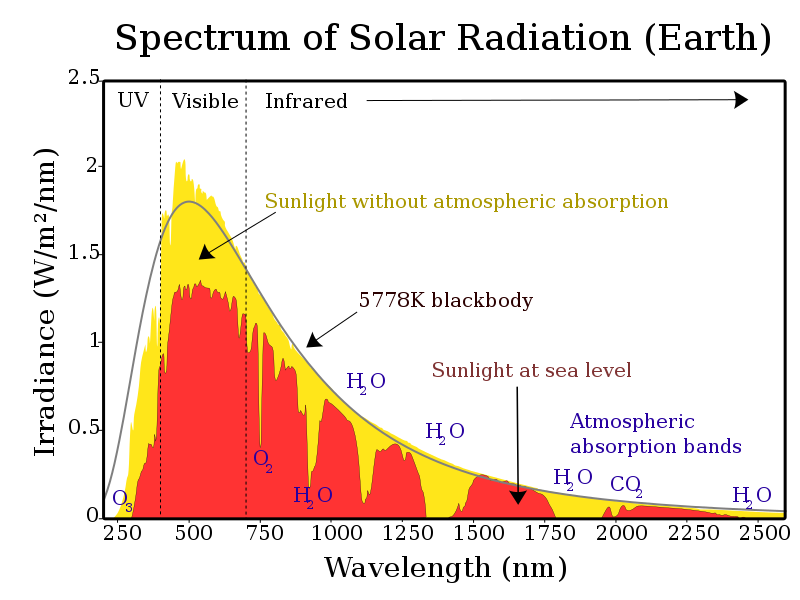
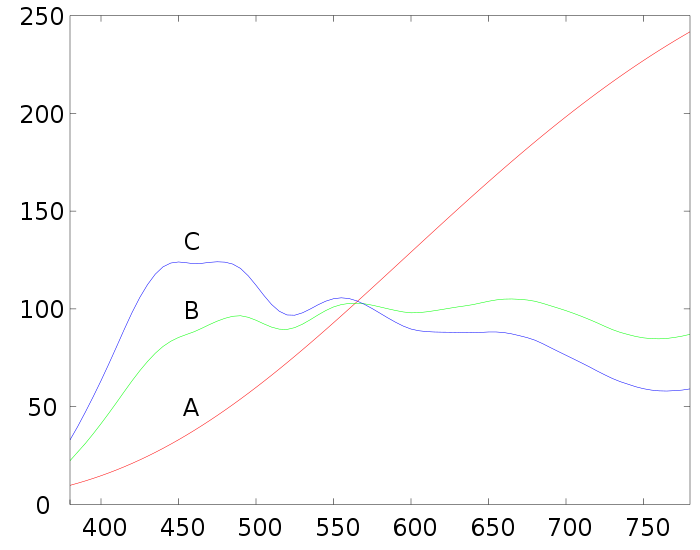

# 光

光是电磁波，可见光是可被人眼感知的电磁波。可见光大约在400-700nm波段[1]。

任何有温度的物体都能发出热辐射。在物理学上，会引入黑体[2]这个理想模型。黑体会吸收所有的光，也就是对所有波长的光的吸收率都为1，相应的，根据基尔霍夫热辐射定律[3]，黑体的发射率也都为1。在相同温度下，黑体发射的热辐射是所有物体中最大的。黑体能发射所有波长的光，各波长能量大小各有不同，这些不同波长不同密度的光形成光谱。黑体的光谱仅和温度相关，符合普朗克定律[4]。

## 参考文献

1. https://en.wikipedia.org/wiki/Light
2. https://en.wikipedia.org/wiki/Black_body
3. [https://en.wikipedia.org/wiki/Kirchhoff%27s_law_of_thermal_radiation](https://en.wikipedia.org/wiki/Kirchhoff's_law_of_thermal_radiation)
4. [https://en.wikipedia.org/wiki/Planck%27s_law](https://en.wikipedia.org/wiki/Planck's_law)
5. x
6. xx
7. x
8. xx
9. xx

## 光源

### 单色光

https://en.wikipedia.org/wiki/Monochromatic_color

## 黑体

https://en.wikipedia.org/wiki/Black_body

## 太阳光谱

https://en.wikipedia.org/wiki/Sunlight

## 标准光源

https://en.wikipedia.org/wiki/Standard_illuminant

