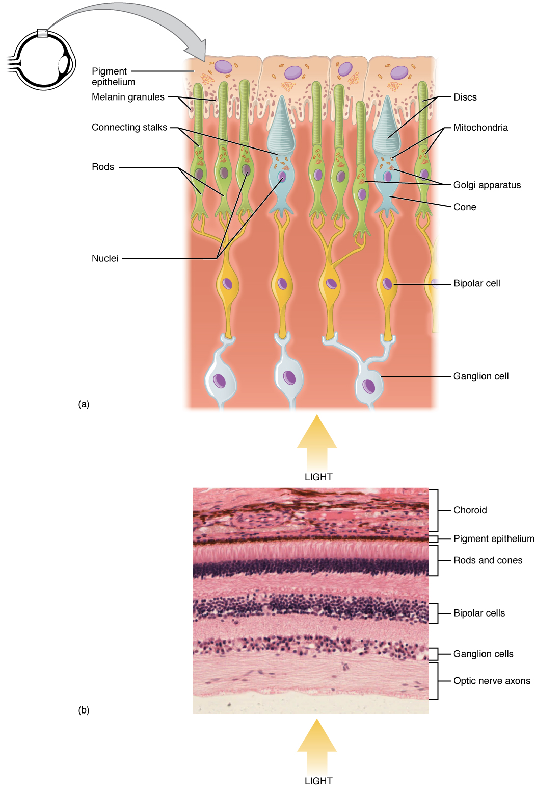

## 人类视觉

人类视觉的产生是接受外界电磁辐射，并传输至大脑，经过大脑的视觉处理而产生的。色觉是人类视觉的一部分，色觉使人能区分不同波长的光源。

### 感光细胞

人体通过[感光细胞](https://en.wikipedia.org/wiki/Photoreceptor_cell)来感应外界电磁辐射，并将转化成生物信号。目前已经发现的在人体存在的三种感光细胞分别是视杆细胞、视锥细胞和自主感光视网膜神经节细胞（ipRGCs），它们均分布在视网膜上。人体拥有1.2亿个视杆细胞，它们仅在较低的光线下起作用，是夜间视觉的主要感光细胞，但对颜色视觉（色觉）的作用很小。自主感光视网膜神经节细胞（ipRGCs）不直接产生视觉，但认为是有助于昼夜节律和瞳孔反应。

人体拥有大约600~700万个视锥细胞，数量上远远少于视杆细胞，但它们却是色觉的主要感光细胞。大部分人眼中有3种视锥细胞，能感应不同波长的光：S锥，M锥和L锥，分别对短波、中波和长波的可见光敏感。下图分别是S锥，M锥和L锥对不同波长的单色光的归一化感应强度图。其中L锥对长波敏感，峰值波长约为560 nm，位于蓝色波段；M锥对中波敏感，峰值波长约为530 nm，位于绿色波段；而S锥对短波敏感，峰值波长约为420 nm，位于蓝色波段。

### LMS三刺激值

对于任何输入光谱，S锥，M锥和L锥分别会对不同的响应的强度，将这些强度归一化后形成0-1之间的三元数值，这个三元数值原则上描述了任何人类的颜色感觉。[LMS色彩空间](https://en.wikipedia.org/wiki/LMS_color_space)便是在这基础上建立的。

不管进入人眼的光谱如何，如果它们对人眼的S锥，M锥和L锥的刺激强度一样，则对人眼来说它们便是同一颜色。比如，对于某一种单色光对应的LMS值，如果取多种单色光调整它们比例，使得产生的混合光的LMS刺激值与指定的LMS值相同，则该混合光对人来说便是同一种颜色，这种现象被称为[同色异谱](https://en.wikipedia.org/wiki/Metamerism_(color))。LMS三元数值被称为三刺激值（tristimulus values）。由于LMS只有3个独立变量，在此基础上发展的很多色彩空间也都是由3个独立变量构成，这些三元组也被称为三刺激值。比如，我们可以选定3种基础颜色来混合出其他颜色，被选定的基础颜色也被称为[原色](https://en.wikipedia.org/wiki/Primary_color)。三原色的选定决定了可表达色彩范围的大小，也称[色域](https://en.wikipedia.org/wiki/Gamut)。最通常选定的三原色便是红色、绿色和蓝色，而由此构成的色彩空间被称为[RGB色彩空间](https://en.wikipedia.org/wiki/Color_spaces_with_RGB_primaries)，其描绘颜色使用R，G，B三个分量，也被称为三刺激值。

对于每个输入光谱来说，总对应着一个LMS值，但并非所有LMS三元值都找到相应的光谱。如不存在M值为0，而L和S值不为0的光谱，这是由于LMS曲线互相交叉的原因。

对于单色光来说，我们根据单色光的波长可以找到LMS值。对于自然光而言，由于自然光是由不同波长的光组成的光谱，我们可以通过计算每个单色光组分的LMS，然后按其单色光在光谱的强度加和起来。
### 对立过程说

光线进入视网膜后，刺激感光细胞仅仅是视觉建立的第一步，只有经过大脑的处理才能最终产生视觉。现在关于大脑如何处理视觉还仅停留在假说阶段，[对手过程说](https://en.wikipedia.org/wiki/Opponent_process)是其中一个影响较大的理论。

色彩对立过程说是由[Ewald Hering](https://en.wikipedia.org/wiki/Ewald_Hering)在1892年提出的。对立过程说认为，LMS三种类型的视锥细胞在记录光的波长存在一定的重叠性，因此对于视觉系统来说，记录LMS之间的差值比记录LMS值更为有效。视觉系统将LMS数据处理成三对对立颜色：红色和绿色，黄色和蓝色，白色和黑色。其中白色和黑色是用于检测亮度。这三组颜色被称为心理原色，并且可以使用这些颜色对的组合来表示所有的颜色。对立过程学可以解释一些许多视觉现象，如[视觉缺陷](https://en.wikipedia.org/wiki/Color_blindness)，[视错觉](https://en.wikipedia.org/wiki/Optical_illusion)等，并在神经机理的研究上获得了证据支持，但目前没有发现心理原色在神经基质的明确映射。对立过程只是人体处理视觉数据中的一步，还需要大脑后续的处理。

## 颜色

### 生物视觉

许多生物都有视觉[1]。昆虫鸟类与有花植物的协同演化中，视觉演化是其中关键的一环。许多昆虫能检测到花朵中的紫外线，以便于它们在花朵中找到花蜜；于此同时，许多花朵在紫外线下能呈现丰富多彩的颜色，来吸引昆虫并引导昆虫的行走路线。

视锥细胞的种类数能直接影响动物对色彩的分辨能力，理论上视锥种类数不少于2，便能感知不同的颜色。海洋类哺乳动物的视锥细胞的种类只有1种，因此是单色色觉，无法分辨颜色。大部分哺乳动物都是双色色觉，意味着他们有2种视锥细胞。灵长类动物大部分是3种视锥细胞。爬行两栖动物通常有4种视锥细胞，意味着他们的色觉远胜于人类。鸟类和昆虫通常有4~5种视锥细胞，以更好的与有花植物进行互动。目前发现视觉蛋白最多的是螳螂虾，高达12种。下图为梅花雀科的四色色觉。

在恐龙时代，哺乳动物主要是小型夜行动物。可能是夜行活动的原因，哺乳动物的祖先在进化的过程中丢失了4个视锥细胞中的2个，与此相对的，提高夜间视觉[2]。进化到灵长类动物时，编码视蛋白的基因发生了复制[3]，其中一份做了修改，使得L锥视蛋白和M锥视蛋白分开，使得灵长类能够区别红色和绿色，重新获得了三色视觉。也因为如此，M锥和L锥的感应曲线仍然非常接近，它们之间的视蛋白的组成非常接近，在视网膜上随机分布并且数量相等[4]。

大部分哺乳动物由于只有2个视锥细胞，且基本上都是红绿色盲。但有些哺乳动物，如猫，由于视蛋白的变异，感化强度曲线往长波方向移动，因而能区分绿色和红色。相比之下，狗只能区分蓝色和黄色，无法区分绿色和红色。

### 人类视觉的差异

人类的色觉在个体之间也有差异。由于遗传突变，人类个体中S锥，M锥和L锥的视蛋白的化学组成有所变化，因此S锥，M锥和L锥的感应曲线也有所不同[1]。人类的S锥视蛋白基因在7号常染色体上，而M锥和L锥视蛋白的基因在X染色体上，且相邻[2]。

色盲可能导致部分人只有2个或以下的视锥细胞，降低人的色觉。色盲通常是遗传性的。色盲最多的是红绿色盲，主要是X染色体上的遗传缺陷，因此主要影响对象是男性，大约8％的男性和0.4％的女性在某种程度上是红绿色盲。其次是蓝黄色盲，主要是常染色体的缺陷，导致S锥视蛋白不能正常合成，不足1%的人类有此项缺陷。还有非常少见的总色盲，无法区别颜色[5]。

此外，使用药物和年纪增大会使人色觉降低[5]。

大约有0.1%的女性可以产生第四种视锥细胞，其敏感度峰值在标准的红色和绿色视锥细胞之间，从理论上讲，显着提高了色觉[4]。

### 色彩是主观感受

对同一束光，不同动物之间看到的颜色不同，甚至每个人之间看到都不尽相同。某种意义来说，存在着电磁辐射和心理颜色表之间的映射关系，而这个关系并不是固定的。语言研究发现，各地民族对颜色的分类不尽相同。此外，研究发现，辛巴人能轻易分辨大多数欧美人无法区分的绿色。这意味着颜色并非物体或电磁辐射的属性，而是观察者视觉感知的特征[1]。只是对于绝大多数人而言，电磁辐射和心理颜色表之间的映射关系大致相同，这便有了普遍的意义。

电磁辐射、LMS值甚至对立颜色都只是人体处理色彩数据的一些中间结果，目前仍然没有技术手段能看到别人眼中的颜色，因此研究的颜色只是大部分人对某种电磁辐射的对应值的一个共有名词而已。研究表明，大脑对颜色的处理受到后天的影响。一些网传的色盲图也并非色盲中真正的世界。虽然对许多颜色的分辨能力降低，但若有着和普通人一样的丰富的心理颜色表，色盲眼中的世界一样是丰富多彩的；而对于四色色觉的部分人类，或许对颜色分辨能力提升，但眼中的世界也未必比一般人类丰富多少。

## 参考文献

1. https://en.wikipedia.org/wiki/Color_vision
2. https://en.wikipedia.org/wiki/Evolution_of_mammals
3. https://en.wikipedia.org/wiki/Evolution_of_color_vision_in_primates
4. https://en.wikipedia.org/wiki/Trichromacy
5. https://en.wikipedia.org/wiki/Color_blindness
6. https://en.wikipedia.org/wiki/Linguistic_relativity_and_the_color_naming_debate
