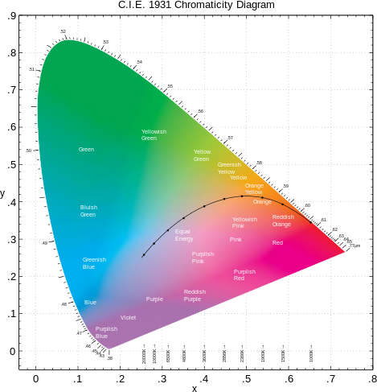
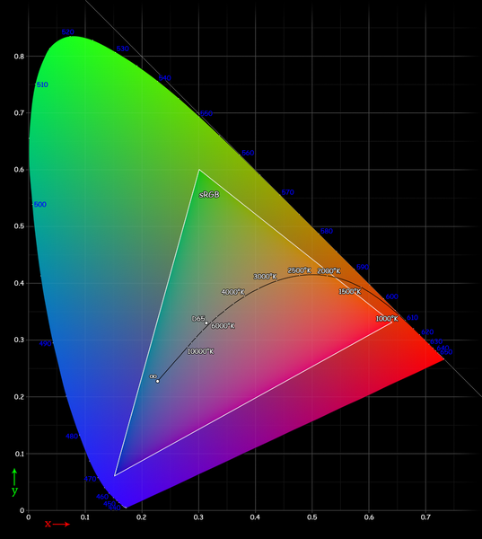
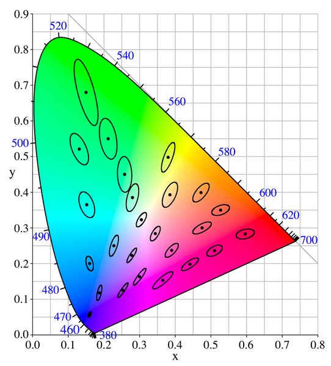
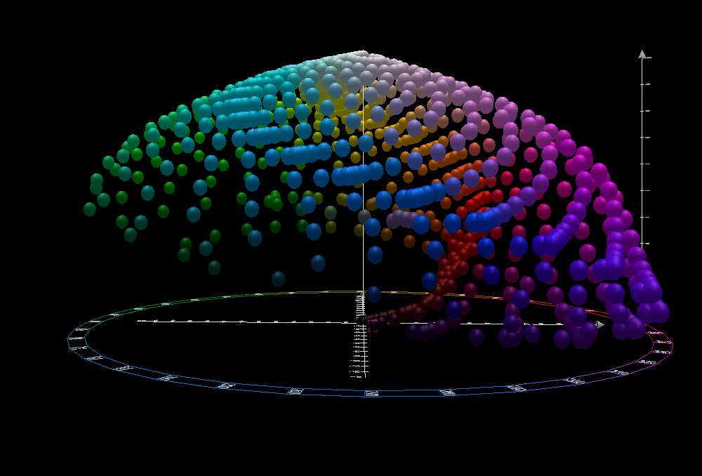

# 色彩空间

色彩空间是一些色彩的集合，色彩空间所包含的所有色彩叫做色彩空间的色域。

色彩空间一个重要的分类是：绝对色彩空间和相对色彩空间。所谓的绝对色彩空间，就是在空间上的点（或称向量）对应的色彩是固定的，不随着外部因素而变化，如[CIEXYZ](https://en.wikipedia.org/wiki/CIE_1931_color_space)，[sRGB](https://en.wikipedia.org/wiki/SRGB)；而所谓的相对色彩空间，实际显示的颜色与物理硬件相关，而非固定不变的， 如[RGB](https://en.wikipedia.org/wiki/RGB_color_space)，[CMYK](https://en.wikipedia.org/wiki/CMYK_color_model)色彩空间，一个RGB图片只是指定了红色、绿色和蓝色的显示比例，实际的显示效果和显示设备（如显示器）使用的灯管有关，因此同一种图片在不同的显示器上看的效果不太一样。

绝对色彩空间因为是对应的色彩是固定的，因此空间可以互相转换；而相对色彩空间，因其色彩并不固定，因此将其转换成绝对色彩空间或是转成其他相对色彩空间都是没有意义的。

相对色彩空间如果其物理硬件的色彩被固定下，也就是指向绝对物理空间的一个点，那么相对色彩空间的色彩就定了下来，那么就将相对色彩空间转换成绝对色彩空间。通过定义一个[ICC](https://en.wikipedia.org/wiki/International_Color_Consortium)配置文件来定义转换关系是许多行业的通用做法。被广泛接受的配置文件定义的RGB颜色包括[sRGB](https://en.wikipedia.org/wiki/SRGB)和[Adobe RGB](https://en.wikipedia.org/wiki/Adobe_RGB_color_space)。

## [CIE LMS色彩空间](https://en.wikipedia.org/wiki/LMS_color_space)

前面说过，人体视网膜的S锥，M锥和L锥能感应外界电磁辐射，并转化成LMS值。由LMS组成的色彩空间就是LMS色彩空间。LMS是绝对色彩空间，因为其不受其他显示设备的影响。

如前所述，部分LMS组合值无法在现实中找到对应的光源，换言之，LMS色彩空间的色域超过了人眼能识别的范围。虽然听起来不可思议，但这在进行理论研究是有好处的。

LMS色彩最主要的用途在于[色彩适应](https://en.wikipedia.org/wiki/Chromatic_adaptation)，在相机中这种称为[色彩平衡](https://en.wikipedia.org/wiki/Color_balance)，[白平衡](https://en.wikipedia.org/wiki/Color_balance)。其原因在于人眼受到的刺激在饱和前与亮度呈线性关系。因此做色彩适应前需要将所用的物理空间转换成LMS空间，而后转回原有空间。

在不同光源下色彩的转换关系：
$$
\begin{bmatrix}L_{d}\\ M_{d}\\ S_{d}\end{bmatrix}=\begin{bmatrix}l_{d}/l_{s} & 0 & 0\\  0& m_{d}/m_{s} & 0\\ 0 & 0 & s_{d}/s_{s}\end{bmatrix}\begin{bmatrix}L_{s}\\ M_{s}\\ S_{s}\end{bmatrix}
$$
其中$L_{s}M_{s}S_{s}$为原图的LMS值，而$L_{d}M_{d}S_{d}$为校正图的LMS值。而$l_{s}m_{s}s_{s}$为原图光源的LMS值，$l_{d}m_{d}s_{d}$为校正图光源的LMS值。

白平衡在LMS空间中的转换关系：
$$
\begin{bmatrix}
L\\ 
M\\ 
S
\end{bmatrix}=\begin{bmatrix}
1/L'_{w} & 0 & 0\\ 
 0& 1/M'_{w} & 0\\ 
0 & 0 & 1/S'_{w}
\end{bmatrix}\begin{bmatrix}
L'\\ 
M'\\ 
S'
\end{bmatrix}
$$
其中$L'M'S'$为待平衡图的LMS值，而$LMS$为平衡后的LMS值。而$L'_{w}M'_{w}S'_{w}$为待平衡图中被认为是白色物体的LMS值。通常使用色卡校正去获取$L'_{w}M'_{w}S'_{w}$值，此外也有非常多的算法用以估计$L'_{w}M'_{w}S'_{w}$值。

## CIE XYZ

国际照明委员会（Commission Internationale de l'éclairage"，CIE）在1931年制定的色彩空间。CIE组织试图去找到最符合人心理的色彩空间。CIE 1931 XYZ色彩空间便是在尽可能模拟感官水平的基础创建起来的。CIE 1931 XYZ色彩空间简称CIE XYZ，仍然是目前广泛使用的色彩空间。某种意义上来说，是绝对色彩空间中的标准空间。

由于LMS色彩空间无法模拟人的心理色彩空间，在此基础上CIE开发了XYZ空间取代LMS。在光线充足的情况下判断不同颜色的相对[亮度](https://en.wikipedia.org/wiki/Luminance)时，人类倾向于感知光谱的绿色部分中的光，因其比相等功率的红色或蓝色光亮。因此，描述不同波长的感知亮度的[光度函数](https://en.wikipedia.org/wiki/Luminosity_function)大致类似于M视锥细胞的刺激值。CIE模型把Y设置成亮度，Z近似于S视锥，而X被选择为非负的响应曲线的混合。

对于D65光源，XYZ空间到LMS空间的转换(von Kries变换)：
$$
\begin{bmatrix}L\\ M\\ S\end{bmatrix}=\begin{bmatrix}0.40024 & 0.7076 & -0.08081\\  -0.2263& 1.16532 & 0.0457\\ 0 & 0 & 0.91822\end{bmatrix}\begin{bmatrix}X\\ Y\\ Z\end{bmatrix}
$$

### CIE xyY空间

色彩的概念可分成2部分，亮度和色度（参考对手过程说）。CIE XYZ空间中Y表示亮度， 因此还需要2个维度来表示色度，定义：
$$
x=\frac{X}{X+Y+Z}\\
y=\frac{Y}{X+Y+Z}\\
z=\frac{Z}{X+Y+Z}\\
$$
使用xyY三元组构成的空间便是xyY空间。xyY空间被每个等Y平面所截的图形就是该亮度下的色度图。色度图通常用于描述CIE XYZ空间。

### CIE XYZ空间的性质

1. 色度图表示普通人可见的所有色度；

2. 如果选择色度图上的任意两个颜色点，则可以通过混合这两种颜色来形成位于两个点之间的直线中的所有颜色；如果选用3个点，则三点构成的三角形就形成了该3种颜料的色域。如下图为sRGB空间的色域；

   

3. 麦克亚当椭圆（MacAdam ellipse）。

   麦克亚当建立了一个实验，其中训练有素的观察者以大约$48cd/m^2$的固定[亮度](https://en.wikipedia.org/wiki/Luminance)观看了两种不同的颜色。一种颜色（“测试”颜色）是固定的，但另一种颜色可由观察者调整，观察者被要求调整该颜色，直到它与测试颜色匹配为止。当然，这种匹配并不是完美的，因为人眼像任何其他乐器一样，准确性有限。MacAdam发现，观察者进行的所有匹配都落入了[CIE 1931色度图](https://en.wikipedia.org/wiki/CIE_1931_chromaticity_diagram)上的椭圆形。

   麦克亚当椭圆意味着在色度空间上，人对颜色等距离的形状是椭圆的，相比之下，欧式空间中距离定义是球形的。这意味着，可以通过线性变换将椭圆变成圆形，这样形成的色彩空间的距离定义与欧式空间相近。

   

## CIE LAB

国际照明委员会（CIE）在1976年定义了CIE LAB色彩空间。它由3个分量组成：L\*，a\*和b\*。其中L\*表示从黑色（0）到白色（100）的亮度，a\*绿色（-）到红色（+）的亮度，b\*蓝色（-）到黄色（+）的亮度。Lab色彩空间旨在逼近人类视觉。Lab色彩空间需要指定白点才能定义绝对颜色。

从LAB到XYZ的空间转换相对复杂，这里只给出了链接（https://en.wikipedia.org/wiki/CIELAB_color_space#CIELAB）。

## sRGB色彩空间

RGB是常见的三原色色彩空间，是个相对色彩空间，其实际的显示效果和显示设备（如显示器）使用的灯管有关。sRGB是RGB空间的通用标准化之一，是个绝对色彩空间。

### gamma校正

通常使用数码相机拍出的照片（RAW格式）的像素数值与实际电磁辐射的亮度成线性关系，而人类对亮度的感知遵循近似的[幂函数](https://en.wikipedia.org/wiki/Power_function)。gamma校正便是将亮度转化成符合人眼感知的程度，并考虑到显示设备CRT中呈现亮度的非线性因素。
$$
V_{out}=AV_{in}^{\gamma}
$$
其中使用$\gamma$=2.2将Adobe RGB色彩空间变成线性化，使用$\gamma$=1/2.2将线性化空间变成Adobe RGB色彩空间；sRGB使用平均意义上的2.2和1/2.2进行线性化和非线性化，但为了避免在0值处产生数值问题，sRGB在0处附近设置成线性函数，并与主要的gamma校正曲线进行相切。

下2图分别是gamma校正前（RAW格式）和gamma校正后

sRGB空间的线性化后，即可与XYZ空间进行线性转换。sRGB与XYZ空间的转换公式比较复杂，链接如下：

https://en.wikipedia.org/wiki/SRGB

sRGB的色域图如下：

## 其他色彩空间

HSL和HSV色彩空间是RGB空间的替代表达，主要目的是在尽可能保留色质的前提下压缩视频传输；
CMYK色彩空间主要应用于打印界。由于使用四种基本色彩去打印图片，使得同一张图片会有多种CMYK组合。