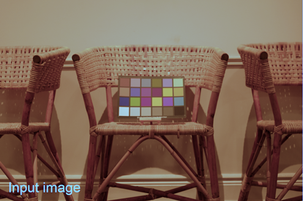

## The Process of Fitting

The above figure is a flow chart of the fitting process. In the figure, a box represents color data, and the contents of the box refer to the color space where the color data is located. CS is short for Color Space. Arrows represent the direction in which data flows in each color space, and indicate the methods used for color space transformation. Blue indicates measurement data, and green indicates reference data. 

### Data Measurement

The box in the upper left corner represents the measurement data, which consists of R, G, and B channels. Since the measurement equipment is not calibrated, the input data is in a relative color space, and the purpose of fitting is to establish the relationship between the relative color space and the absolute color space.

During the whole fitting process, all color spaces values must be normalized, that is, the value range is [0, 1].  

### Linearization

The first operation on the measured data is to linearize it. The measurement data may have a non-linear relationship with illuminant due to the physical mechanism of the measurement system or to adapt to the habit of the human eye. If we do not linearized, the linearized absolute color space cannot be effectively approximated by a linear transformation. Only when the relative color space and absolute color space are proportional to the illuminance, can the linear transformation be used to approximate the color conversion between the two.

Since the measured color space has not been calibrated, it cannot directly use the linearization process of absolute color spaces such as sRGB, Adobe RGB. Unless we fully grasp the physical mechanism of the measurement process, we can only use some empirical methods to linearize. There are several types of linearization that are commonly used empirically. One is to use gamma correction, the gamma value is usually set to 2.2,  and can also be customized. The second is to use polynomial fitting. In order to prevent overfitting, the degree of polynomial usually does not exceed 3, and the specific fitting method can be subdivided into several types. If the input measurement data is in RAW format, the measurement data is already linearized, so there is no need to perform linearization, or it can be equivalently considered to use the identity linearization method. The linearization method used in this program will be introduced in another article.

### CCM Matrix

After the linearization of the measurement data, the linear transformation is used to transform the data into a linear absolute RGB color space. Performing a linear transformation is equivalent to multiplying by a matrix which we called the color correction matrix(CCM)[1]. The CCM matrix is also our goal for fitting. We can set the specific color space after linear transformation, such as Linear sRGB, Linear Adobe RGB, etc. Set 1 in the figure is the position to set the color space. Normally, the color space needs to be the same as the color space where you want to save the data so as to reduce the conversion of the color space in the inference process.

The shape of the CCM matrix is usually $3\times3$ and $4\times3$. The former performs linear transformation on the value of color, while the latter performs affine transformation. In other words. The color space keeps the origin unchanged after the former is transformed, while the latter can be translated. It can be seen that the transform set of the CCM matrix of $3\times3$ is the proper subset of $4\times3$, which means that the solution set fitted by the $4\times3$ CCM matrix is larger. However, the latest papers prefer to use the CCM matrix of $3\times3$ instead of the latter.

### Color Difference

When the measurement data is converted into an absolute color space, we need to evaluate whether the converted result is close to the reference value. The function used for evaluation is called the loss function. We need to find the appropriate value of CCM to reduce the loss as much as possible. The loss function is usually defined as the weighted square sum of the color difference between all measured data and reference data. So in order to calculate the loss function, we need to calculate the color difference. The common standards for color difference[2] are CIE76, CIE94, CIEDE2000, and CMC. These standards are based on the CIE lab color space, so we usually need to convert the linearly transformed color space into the CIE lab color space so as to calculate the distance. Of course, we can also use non-standard distance equations, such as directly using the set Euler distance of the absolute RGB color space, or the set Euler distance of the linearized absolute RGB color space. The former may have few applications in machine vision, while the latter can be used as a test or to generate initial values for fitting when using other distance equations due to the convenience of calculation. We can set a specific distance formula at the position of Set 2.

Therefore, after linear transformation, we need to convert the color space to the CIE lab color space. Only by specifying the white point can the CIE lab space be truly established. We assume that the white point is the standard light source, and use the standard Illuminant type and standard observer(IO) to specify the specific standard Illuminant . Although the specific formula itself does not need to determine the CIE lab space, that is to say, there is no need to specify the IO value, but only under the specified IO value, the conversion relationship between the specified linearized absolute RGB color space and the CIE LAB color space can be established. Thus, if you choose the distance formula related to CIE lab in Set 2, you also need to set the IO value to ensure the correct conversion of the color space. In order to distinguish it from the IO value later, the IO value here is called IO_1.

At the same time, the reference data also needs to be converted into the color space corresponding to the distance formula. Since the reference data itself is in an absolute color space, we only need to perform color space conversion directly. Therefore, in addition to enter the parameter color value, we also need to enter the color space where the color value is located, such as sRGB, CIE lab, etc. If it is a CIE lab space, we also need the IO value to determine the color space in order to determine the true value of the reference color. The IO set here is called IO_2. The reference color and color space establish absolute reference data, which we call the ColorChecker . Since the same ColorChecker may be used for fitting multiple devices, we distinguish the color space of the ColorChecker from the RGB color space of Set 1 and the color space used by the distance of Set 2 to avoid manual conversion before fitting the color space from the reference value to the color space where Set 1 or Set 2 is located.

### Nonlinear Optimization

#### Loss Function and Ratio

When both the measurement data and the reference data are converted into the color space where the distance formula is located, we can calculate the color difference and even the loss function. As mentioned above, the loss function is usually the weighted square sum of the color difference values of all the measured data and reference data, and this weight value usually has several setting methods: one is the default, then the status of all color difference values is equal; The second is the power of proportionality and brightness[1]. The brightness here is the l* component of the color in the CIE lab color space; the third is manual input, which is more flexible, but the premise is that the user fully grasps the relevant knowledge in the field of color. All weights will be normalized in order to compare the loss function values. Normalization does not affect the convergence of the loss function.

Not all colors can participate in the calculation of the final loss function. The biggest reason for exclusion is saturation[1]. If one of the measured R, G, and B channels reaches or is very close to the maximum value, it is likely that saturation has occurred in this channel, that is, the actual illumination of this channel exceeds the maximum value. So the illuminance value of this channel will be truncated due to the measurement equipment’s limit. The occurrence of saturation means that the measured value of the channel may not reflect the true value resulting in the color cannot be linearized. If this color is used for fitting, other colors may be shifted in order to take care of its non-linear characteristics. Therefore, once any one of channel is saturated, the saturated color needs to be removed. For the same reason, the saturation channel cannot be used to calculate the parameters of the linearization process.

The second reason for excluding color is the color distance formula. Generally, the CIEDE2000 standard is considered to be the closest to the psychological distance standard of people, but the CIEDE2000 distance function is not continuous[3]. The distance equation for a reference color has a large discontinuity near the direction away from the color position on the a* b* plane, so this discontinuity is likely to occur in colors very close to the origin, which is black, white and gray. The following figure is the contour line near the No. 19 color of the standard Macbeth ColorChecker. The color is white, and the position where the distance function is discontinuous can be clearly seen. Near the discontinuous position, the triangle inequality cannot be satisfied. To be precise, the CIEDE2000 distance function is not a metric and cannot be called a distance function. Although the conclusion that this discontinuity will affect the convergence of the loss function is too arbitrarily, we provide the option of excluding black, white and gray when calculating the loss function, hoping to improve the loss function by improving the differential nature of the loss function.

#### Influence of Distance Function

For the most part, we use nonlinear optimization to calculate the CCM matrix. The main reason is that the conversion from the specified linearized RGB space to the color distance space is a nonlinear process. But if the distance function is linear RGB, then this conversion process becomes identity transformation, so we can directly use the weighted least square method to find the optimal CCM matrix. This also provides a way to generate nonlinear optimization initial values under other distance functions, which is also a recommended way. The other is to maintain the initial value of white balance.

If the distance function is the CIE lab color space, then the optimal solution for setting different RGB spaces is essentially no different. It is the different expression of the same color in different color spaces. The reason is that each linear RGB space differs by only one linear transformation, which is defined as Linear RGB Colorspace Conversion Matrix(LRCCM ) in this article. If the value of the CCM matrix in the Linear RGB I space is $CCM_1$, and convergence to a certain color group C; then when the CCM matrix is taken as $(LRCCM_{II\to I})*CCM_1$, the color group C will also be obtained on the Linear RGB II. If Linear RGB II has a better convergence matrix $CCM_2$ and can obtain a better color group C* than C, then the CCM matrix in Linear RGB I space is $(LRCCM_{I\to II})*CCM_2 $. Thus, the Linear RGB I space can obtain a better color group C* than color group C, which contradicts the optimal solution of color group C. According to the above simple reasoning, we can prove that when the space to which the distance function belongs is the CIE lab distance function, there is no essential difference in the RGB space which we set before. Of course, since the function of converting RGB into CIE lab is non-convex, this nonlinear optimization process cannot guarantee global optimality, and using different RGB spaces is likely to converge to different local optimal color groups.

There may be a few reasons to use the RGB color distance formula. At this time, because the conversion between linear RGB to RGB may be different for different RGB spaces, setting different RGB spaces at this time will cause different convergence results.

#### Optimization

Since the most commonly used distance formula for CIEDE2000 is not continuous, the nonlinear optimization method based on derivatives cannot be used. The Nelder-Mead method is the most widely used non-derivative nonlinear optimization method. We also prefer to use this method as a nonlinear optimization method. As mentioned earlier, the global optimum cannot be guaranteed, so the choice of different initial values and the choice of different RGB spaces may converge to different local optimums, even if the distance function is set to the CIE lab color space.

After the fitting, we can evaluate the model. Although this part can be directly evaluated after the fitting is completed, for logical reasons, this part is placed after the inference process part.

## Inference Process

The inference process requires a similar process to the fitting process, but it is much simpler. For the input picture, we use the linearization method used in the fitting to perform linearization, and then multiply it by the CCM matrix. At this time, the data belongs to an absolute linear RGB color space. In general, we need to convert the linearized RGB space into RGB space, and then output the image; but occasionally, we can also choose to output the Linear RGB image directly for subsequent processing. Note that the delinearization process of converting linearized RGB space to RGB space is determined by the color space, and has nothing to do with the previous linearization process.

Since the inference process needs to use the linearization method of the fitting process, the CCM matrix, and the specific RGB space (for delinearization). Therefore, the model generated by the fitting process must include at least these three contents.

## Evaluation Model

### Color Space and Color Distribution

In order to explain the evaluation model, we first introduce the changes in color space and color distribution during the inference process.

#### Color Space

Since we use three component values to describe color, the values of the color space also constitute a space, which is a subspace of $R^3$. The numerical space is the numerical description of the color space, and there is no difference in the mathematical sense. So in the following content we will not distinguish between the color space and its corresponding numerical space. Since all the RGB spaces in this paper, whether linear or not, are quantized in the interval $[0,1]$. So the color space is $S_1=[0,1]^3$ during the inference process.

During linearization, the linearized color space $S_2$ is still $[0,1]^3$ when we choose gamma correction for the map of gamma correction is $[0,1]$ to $[0,1]$. But when we choose polynomial fitting, the map of interval is not always from $[0, 1] $ to $[0,1]$. $[C_{a},C_{b}]$, We assume that it is mapped to $[C_{a},C_{b}]$, where $C$ is the color channel. After polynomial fitting, the color space is still a cuboid and domain of space converted from $[0,1]^3$ to $[R_{a},R_{b}]\times[G_{a},G_{b}]\times[B_{a},B_{b}]$.

Next, we multiply the CCM matrix, which is equivalent to performing a linear transformation on the original color space, and the generated space is recorded as $S_3$. If we use the CCM matrix of $3\times3$, the shape of the space is transformed from the cuboid to a parallelepiped, and the origin keep unchanged. The space using $4\times3$ CCM matrix becomes a parallelepiped, but the origin shifted. A part of the parallelepiped space formed at this time is still within $[0,1]^3$, while a part may be outside $[0,1]^3$.

Finally, we perform delinearization to $S_4$ space. In this step, although the conversion functions of different color spaces are not the same, they all map from $[0,1]$ to $ [0,1]^3$. This means that the colors in $S_3\cap [0,1]^3$ space are correctly mapped to the $S_4$ space. And the colors in the $S_3-[0,1]^3$ space are saturated, which will be truncated within $[0,1]^3$ eventually.

#### Color Distribution

Next we will describe the color distribution (CD). In the color space. Some colors may be more common than others, which forms a color probability space, and the distribution of colors in the color space is called color distribution.

For the initial color distribution, if a large number of captured pictures have been obtained in the input color space, then one color distribution can be counted as the initial color distribution; if there is no relevant data, we can make the following approximation. One is that we can simply assume that colors are uniform distributed throughout the color space. Although it is not realistic, the processing is simple; the other is that we can use a large number of pictures to obtain an average color distribution for statistics, and then use this color distribution as the initial distribution. It should be noted that the uncalibrated color space often has a shift in a certain direction, so using the average color distribution is usually different from the initial distribution, but it is a good approximation.

During linearization, the color space does not change when gamma correction is used,  but the color distribution changes. Assuming gamma=2.2, more colors will run closer to the origin, so that the density of colors near the origin becomes greater while the density of colors at [1,1,1] becomes smaller. The same thing happens with polynomial fitting. If a polynomial fit of more than two degree is used, the color density will be smaller where the derivative is large, and the color density will be greater where the derivative is small.

Suppose the input color space is uniform distributed on $[0,1]^3$. When we use the polynomial $y=2x$ for polynomial fitting, the color space is evenly mapped from $[0,1]^3$ to $[0,2]^3$ of which only $12.5%$ of the colors are still in $[0,1]^ 3$ spaces. If the CCM matrix is an identity matrix, this means that 87.5% of the colors are saturated. When we use the polynomial $y=2x^3$ for polynomial fitting, the color space is still mapped to $[0,2]^3$, but only $50 \%$ of the colors are saturated in the end. It can be seen that on the issue of quantifying color saturation, it is not enough to discuss color space.

Next, CD will multiply by the CCM matrix. Although the linear transformation will change the specific color density value, it will not change the original sparse relationship.

In the final delinearization process, the color density changes again.

### 

### Model Evaluation Metric

The difference of model results obtained by different parameter is very obvious. So how to evaluate the quality of a model before inference? This article proposes three metrics:

The first is **residual error**. Residual error is the square root of the value of the loss function at convergence, which is also the most important metric. The smaller the residual, the closer the measurement data generated after passing the model to the reference data. Although it is not guaranteed, it usually means that other color values can be closer to the true value after conversion. Usually the residual is 5 in CIE76 and CIE94, and 3 in CIEDE2000 is a very good result. The residual values calculated in RGB and Linear RGB spaces are usually small and cannot be directly compared with the residual values of CIE76, CIE94, and CIEDE2000.

The second is **supersaturation**. The first picture below is the original picture[4], and the second and third pictures are the results of the model inference after a certain parameter fitting. For the residual , the model in Figure 2 is about 14, while the figure 3 is about 10. The loss value in Figure 3 is slightly smaller. But it can be seen that the inference result of 3 is not very good. There are many highlights in the figure that are very abnormal. The reason is that some color channels are over-saturated and truncated in these highlights. We therefore define **the supersaturation of the input color** as the Euclidean distance of the final output color to the space of $[0,1]^3$. If the color of output is in space  $[0,1]^3$, the Euclidean distance at this time is 0. Therefore, the supersaturation of the final evaluation model is defined as the mean value of supersaturation for a random input color. It should be noted that the distribution of random input is not specified. As mentioned earlier, mean value can reflect the RGB distribution of the actual device, but due to practical limitations, it may be approximated by a uniform distribution or a statistical average distribution. For an input with a uniform initial distribution, the supersaturation result of Figure 2 is much smaller than that of Figure 3.

The third is **cover volume**. It is defined that the final output occupies the volume on $[0,1]^3$, that is, the volume of $S_4\cap[0,1]^3$. If supersaturation is the only evaluation metric, it is easy to make the model output result in the direction of reduction, which will lead to a reduction in the coverage volume. Therefore, with the coverage volume as the standard, the model can be comprehensively evaluated.

It is very complex to directly calculate the integral for the judgment criteria of the second and third metric, and it is much simpler to use the Monte Carlo method. Random multiple colors, according to the input distribution, calculate the final color supersaturation, and obtain the mean value, which is the approximate value of the second metric;  and the third metric could be obtained by generating colors uniformly in the $[0,1]^3$ space, inversely calculate whether the original image is in the $[0,1]^3$ space, and the ratio obtained is the coverage volume.

## References

1. https://www.imatest.com/docs/colormatrix/
2. https://en.wikipedia.org/wiki/Color_difference
3. Sharma, Gaurav; Wu, Wencheng; Dalal, Edul N. (2005). ["The CIEDE2000 color-difference formula: Implementation notes, supplementary test data, and mathematical observations"](http://www.ece.rochester.edu/~gsharma/ciede2000/ciede2000noteCRNA.pdf) (PDF). *Color Research & Applications*. [Wiley Interscience](https://en.wikipedia.org/wiki/Wiley_Interscience). **30** (1): 21–30. [doi](https://en.wikipedia.org/wiki/Doi_(identifier)):[10.1002/col.20070](https://doi.org/10.1002%2Fcol.20070)
4. http://cvil.eecs.yorku.ca/projects/public_html/sRGB_WB_correction/dataset.html