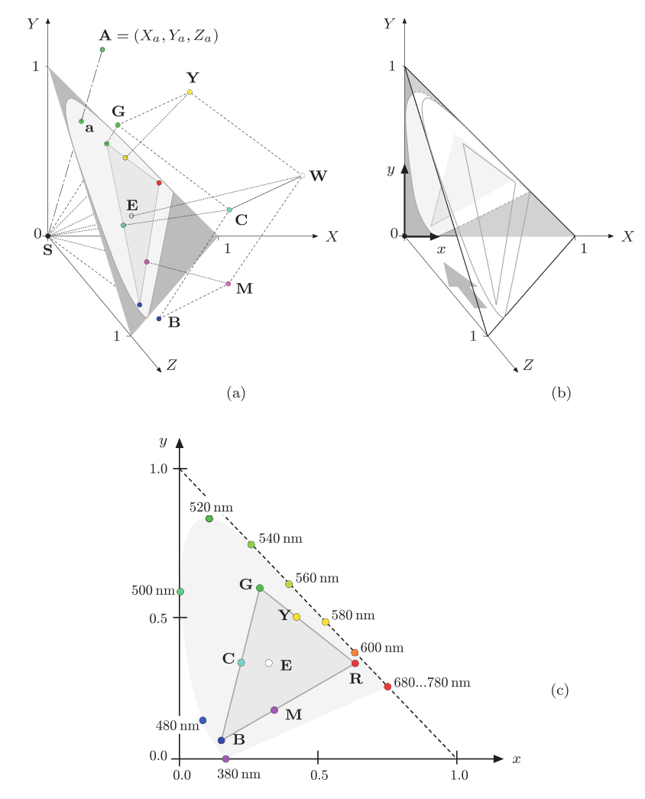
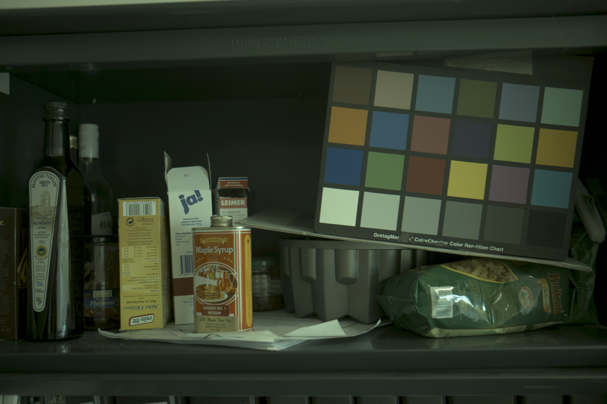

# 色彩空间

色彩空间[1]是一些色彩的集合，色彩空间所包含的所有色彩叫做色彩空间的色域。

色彩空间一个重要的分类是：绝对色彩空间和相对色彩空间。所谓的绝对色彩空间，就是在空间上的点（或称向量）对应的色彩是固定的，不随着外部因素而变化，如[CIEXYZ](https://en.wikipedia.org/wiki/CIE_1931_color_space)，[sRGB](https://en.wikipedia.org/wiki/SRGB)；而所谓的相对色彩空间，实际显示的颜色与物理硬件相关，而非固定不变的， 如[RGB](https://en.wikipedia.org/wiki/RGB_color_space)，[CMYK](https://en.wikipedia.org/wiki/CMYK_color_model)色彩空间，一个RGB图片只是指定了红色、绿色和蓝色的显示比例，实际的显示效果和显示设备（如显示器）使用的灯管有关，因此同一种图片在不同的显示器上看的效果不太一样。

绝对色彩空间因为是对应的色彩是固定的，因此空间可以互相转换；而相对色彩空间，因其色彩并不固定，因此将其转换成绝对色彩空间或是转成其他相对色彩空间都是没有意义的。

通常情况下，绝对色彩空间是在某光源下测量的，不同光源下的色彩空间的转换过程称为色彩适应。可参考标准光源部分内容。

相对色彩空间如果其物理硬件的色彩被固定下，也就是指向绝对物理空间的一个点，那么相对色彩空间的色彩就定了下来，那么就将相对色彩空间转换成绝对色彩空间。通过定义一个[ICC](https://en.wikipedia.org/wiki/International_Color_Consortium)配置文件来定义转换关系是许多行业的通用做法。被广泛接受的配置文件定义的RGB颜色包括[sRGB](https://en.wikipedia.org/wiki/SRGB)和[Adobe RGB](https://en.wikipedia.org/wiki/Adobe_RGB_color_space)。

## LMS色彩空间

前面说过，人体视网膜的S锥，M锥和L锥能感应外界电磁辐射，并转化成LMS值。由LMS组成的色彩空间就是[CIE LMS色彩空间](https://en.wikipedia.org/wiki/LMS_color_space)。直接使用LMS色彩空间来描述人对色彩的感受比较难，通常需要转换成其他色彩空间使用。

## CIE XYZ色彩空间

[国际照明委员会](https://en.wikipedia.org/wiki/International_Commission_on_Illumination)（Commission Internationale de l'éclairage"，CIE）在1931年制定的色彩空间。CIE组织试图去找到最符合人心理的色彩空间。CIE 1931 XYZ色彩空间便是在尽可能模拟感官水平的基础创建起来的。CIE 1931 XYZ[2]色彩空间简称CIE XYZ，仍然是目前广泛使用的色彩空间。某种意义上来说，是绝对色彩空间中的标准空间。

由于LMS色彩空间无法模拟人的心理色彩空间，在此基础上CIE开发了XYZ空间取代LMS。在光线充足的情况下判断不同颜色的相对[亮度](https://en.wikipedia.org/wiki/Luminance)时，人类倾向于感知光谱的绿色部分中的光，因其比相等功率的红色或蓝色光亮。因此，描述不同波长的感知亮度的[光度函数](https://en.wikipedia.org/wiki/Luminosity_function)大致类似于M视锥细胞的刺激值。CIE模型把Y设置成亮度，Z近似于S视锥，而X被选择为非负的响应曲线的混合。

CIE XYZ定义了标准观察者，由此定义了色度函数$\bar{x}(\lambda),\bar{y}(\lambda),\bar{z}(\lambda)$，这3个色度函数是XYZ三刺激值关于波长$\lambda$的密度函数，在光谱功率分布为$I(\lambda)$的光源下，反射率为$S(\lambda)$的物体的XYZ为：
$$
X=k\int_{\lambda}{S(\lambda)I(\lambda)\bar{x}(\lambda)d\lambda}\\
Y=k\int_{\lambda}{S(\lambda)I(\lambda)\bar{y}(\lambda)d\lambda}\\
Z=k\int_{\lambda}{S(\lambda)I(\lambda)\bar{z}(\lambda)d\lambda}\\
$$
其中$k$为系数。

色度函数的选定保证了XYZ三刺激值均为非负值，保证了Y轴为亮度，保证了光源E下的白点色度坐标是(1/3, 1/3)等性质。

在观察者选定、光源选定的情况下，可以计算物体和白点的XYZ值，可以从而构造出色彩空间来。CIE XYZ空间是以标准观察者标准光源E（2 deg illuminant E，E_2）下构造的。而sRGB是在标准观察者标准光源D65下（2 deg illuminant D65，D65_2）进行的。

关于白点、光源和观察者等内容，会在标准光源下讨论。

### 色度空间

色彩的概念可分成2部分，亮度和色度。CIE XYZ空间中Y表示亮度， 因此还需要2个维度来表示色度，定义：
$$
x=\frac{X}{X+Y+Z}\\
y=\frac{Y}{X+Y+Z}\\
z=\frac{Z}{X+Y+Z}\\
$$
使用xyY三元组构成的空间便是xyY空间。将XYZ空间中的点映射到该点与原点的连线与X+Y+Z=1平面上的交点，然后将X+Y+Z平面直接射影到Z=0的平面而生成的。X，Y，Z比例相同的点被映射到了同一点，因此消除了亮度的影响。最终XYZ平面被映射到xy平面中由(0,0), (0,1), (1,0)构成的三角形中[3]。这就是大名鼎鼎的色度图。

### 色度图的性质

1. 色度图表示普通人可见的所有色度；

2. 如果选择色度图上的任意两个颜色点，则可以通过混合这两种颜色来形成位于两个点之间的直线中的所有颜色；如果选用3个点，则三点构成的三角形就形成了该3种颜料的色域。由于色度图为舌形，意味着无法使用三种在色度图内的颜色构成的色域来涵盖所有的色度。如下图为sRGB空间的色域；

   

3. 性质2决定了在色域图舌形边缘上分布的是单色光，而白点是各种波长光线的混合，是在色度图内；

4. 麦克亚当椭圆[4]（MacAdam ellipse）。

   麦克亚当建立了一个实验，其中训练有素的观察者以大约$48cd/m^2$的固定[亮度](https://en.wikipedia.org/wiki/Luminance)观看了两种不同的颜色。一种颜色（“测试”颜色）是固定的，但另一种颜色可由观察者调整，观察者被要求调整该颜色，直到它与测试颜色匹配为止。当然，这种匹配并不是完美的，因为人眼像任何其他乐器一样，准确性有限。MacAdam发现，观察者进行的所有匹配都落入了[CIE 1931色度图](https://en.wikipedia.org/wiki/CIE_1931_chromaticity_diagram)上的椭圆形。

   麦克亚当椭圆意味着在色度空间上，人对颜色等距离的形状是椭圆的。CIE XYZ空间下色彩是不均匀的，为此，CIE又提出了多种其他的色彩空间。

   

## CIE Lab

国际照明委员会（CIE）在1976年定义了CIE Lab色彩空间[5]。CIE Lab是建立在对立过程说的理论基础之上。它由3个分量组成：L\*，a\*和b\*。其中L\*表示从黑色（0）到白色（100）的亮度，a\*绿色（-）到红色（+）的亮度，b\*蓝色（-）到黄色（+）的亮度。Lab色彩空间旨在逼近人类视觉，尽可能使得色彩变得均匀。

从CIE Lab到XYZ的空间转换相对复杂，可详见[5]。

CIE Lab色彩空间最主要的作用在于作为色彩距离[6]公式定义的基础，CIE发布的多种色彩距离公式都是定义在CIE lab上。

## RGB色彩空间

RGB色彩空间[7]是三原色的色彩空间，RGB色彩空间中的颜色是由三原色的分量来定义。如果三原色的色彩未定义，则RGB色彩空间是相对色彩空间。但当RGB的三原色红色、绿色和蓝色在绝对色彩空间定义后，此时RGB色彩空间就变成绝对色彩空间。比如未进行色彩校正的相机，生成的RGB图就是是相对色彩空间，图片里颜色的RGB三分量的数据与相机的感光系统相关。而色彩校正的目的便是建立这个相对色彩空间与绝对色彩空间之间的关系。

RGB色彩空间是一系列色彩空间，后面主要讨论其中的绝对色彩空间，包括sRGB， Adobe RGB等。这些色彩空间进行绝对化的主要区别是在三原色的定义和线性化的标准。

### 三原色的定义

在定义色彩空间时，要先选定白点和观察者。然后在白点的基础上构建的XYZ空间上选定三原色。通常三原色选择会忽略亮度，选择在色度空间内选取。选取白点、观察者和三原色后，RGB空间便定义下来了。

一些RGB色彩空间的三原色的定义如下，其中观察者均为默认观察者，因为未列入表格：

|                | White Point | xR       | yR       | xG       | yG       | xB       | yB       |
| -------------- | ----------- | -------- | -------- | -------- | -------- | -------- | -------- |
| sRGB           | D65         | 0.64     | 0.33     | 0.30     | 0.60     | 0.15     | 0.06     |
| Adobe RGB      | D65         | 0.64     | 0.33     | 0.21     | 0.71     | 0.15     | 0.06     |
| Wide Gamut RGB | D50         | 0.7347   | 0.2653   | 0.1152   | 0.8264   | 0.1566   | 0.0177   |
| ProPhoto RGB   | D50         | 0.734699 | 0.265301 | 0.159597 | 0.840403 | 0.036598 | 0.000105 |
| DCI P3         | D65         | 0.68     | 0.32     | 0.265    | 0.69     | 0.15     | 0.06     |
| Apple RGB      | D65         | 0.625    | 0.34     | 0.28     | 0.595    | 0.155    | 0.07     |
| REC. 709       | D65         | 0.64     | 0.33     | 0.30     | 0.60     | 0.15     | 0.06     |
| REC. 2020      | D65         | 0.708    | 0.292    | 0.17     | 0.797    | 0.131    | 0.046    |

由于在色域图上，三原点构成的三角形涵盖了以这三原点组合得到的所有颜色，也被称为**色域**。因此，之前定义了RGB图三原点的在色域图上的位置，可以在色域图上画出各RGB空间图的色域[1]。

sRGB是目前计算机显示器最常见的色彩空间，然而色域有限；而Adobe RGB，Wide Gamut RGB等色彩空间的色域相对就大得多。

### 线性化与反线性化

通过定义了三原色和白点，此时线性化的RGB的色彩空间已经定了下来。此时色彩空间的颜色各分量值与亮度成正比，但却不符合人类的视觉感受。人类对亮度的感知却是非线性的，遵循近似的幂函数，对较暗色调之间的相对差异比起亮色调之间的相对差异更敏感。因此，通常需要对色彩空间使用**伽马校正**来符合人类视觉感受。

伽玛校正[8]由以下幂律表达式定义：

$$V_{out} = AV_{in}^{\gamma}$$

由于早期显示设备阴极射线管（CRT）显示器，光强度随电子枪电压非线性变化，因此伽玛校正不仅要用于补偿阴极射线管（CRT）显示器的非线性性，还要修正人类视觉感受。即便目前显示设备发生变化，伽马校正的标准却也定了下来。目前，绝大多数的RGB色彩空间的解码伽马值为2.2。

下2图分别是gamma校正前（RAW格式）和gamma校正后[9]。

## 其他色彩空间

[HSL和HSV色彩空间](https://en.wikipedia.org/wiki/HSL_and_HSV)是RGB空间的替代表达，主要目的是在尽可能保留色质的前提下压缩视频传输；
[CMYK色彩空间](https://en.wikipedia.org/wiki/CMYK_color_model)主要应用于打印界。由于使用四种原色去打印图片，使得同一张图片会有多种CMYK组合。

## 参考文献

1. https://en.wikipedia.org/wiki/Color_space
2. https://en.wikipedia.org/wiki/CIE_1931_color_space
3. W. Burger, M.J. Burge. [Principles of Digital Image Processing: Core Algorithms](https://www.sciencedirect.com/science/article/pii/S1361841510000125#bbib4). Springer-Verlag (2009)
4. https://en.wikipedia.org/wiki/MacAdam_ellipse
5. https://en.wikipedia.org/wiki/CIELAB_color_space
6. https://en.wikipedia.org/wiki/Color_difference
7. https://en.wikipedia.org/wiki/RGB_color_space
8. https://en.wikipedia.org/wiki/Gamma_correction
9. https://www2.cs.sfu.ca/~colour/data/shi_gehler/