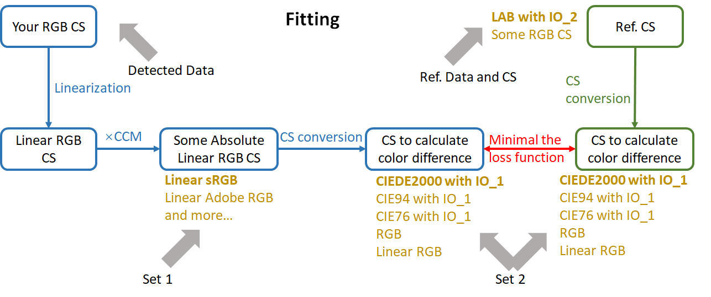

## Fitting Process

The above figure is a flow chart of the fitting process. In the figure, a box represents color data, and the text inside the box indicates the current color space (CS) of the color data. The arrows between color spaces represent the direction of data flow, and the text on the arrows indicate the method used for color space conversion. Blue indicates detected data, while green indicates reference data. 

### Detected Data

The box in the upper left corner represents the detected data, which consists of R, G, and B channels. Since the detection equipment is not calibrated, the detected data is in a relative color space, and the purpose of fitting is to establish the relationship between the relative color space and the absolute color space.

During the whole fitting process, all data values of RGB color spaces should be normalized, that is, in [0, 1].  

### Linearization

The first operation on the detected data is linearization. The detected data may have a non-linear relationship with luminance due to the physical mechanism of the detection system or to adapt to the human perception of brightness. Without linearization, the linear absolute color space cannot be effectively approximated by a linear transformation. Only when the tristimulus values of both the relative color space and absolute color space are all proportional to the luminance, can the linear transformation be used to approximate the color conversion between the two.

Since the detected color space has not been calibrated, it cannot directly use the linearization process of absolute color spaces such as sRGB, Adobe RGB. Unless we fully grasp the physical mechanism of the measurement process, we can only use some empirical methods to linearize. There are several types of linearization that are commonly used empirically. The first is gamma correction. The gamma value is usually set to 2.2,  and can also be customized. The second is polynomial fitting. In order to prevent overfitting, the degree of polynomial usually does not exceed 3. The specific fitting methods can be subdivided into several types. The third is the identity transformation, that is, no change is made. For measurement data in RAW format, since it is already linear data, it is sufficient to use identity transformation. The linearization method used in this program will be introduced in another article.

### CCM

After the linearization of the detected data, a linear transformation is used to transform the data into a linear absolute RGB color space. Performing a linear transformation is equivalent to multiplying by a matrix which we called the color correction matrix(CCM)[1]. CCM is also our goal for fitting. We can set the specific color space after linear transformation, such as the linear sRGB and the linear Adobe RGB. Set 1 in the figure is the position to set the color space. Normally, the color space needs to be the same as the color space where you want to save the data so as to reduce the color space conversion in the inference process.

The shape of CCM is usually $3\times3$ or $4\times3$. The former performs linear transformation on color values, while the latter performs affine transformation. In other words. The color space keeps the origin unchanged after the linear transformation, while the latter can be translated. It can be seen that the transform set of $3\times3$ CCM is the proper subset of $4\times3$, which means that the solution set fitted by $4\times3$ CCM is larger. However, the latest papers prefer to use $3\times3$ CCM.

### Color Difference

When the detected data is converted into an absolute color space, we need to evaluate whether the conversion result is close to the reference value. The function used for evaluation is called the loss function. We need to find the appropriate CCM  to minimal the loss function. The loss function is usually defined as the weighted square sum of the color difference (or color distance) between detected data and reference data.  So in order to calculate the loss function, we need to calculate the color difference. The common standards for color difference[2] are CIE76, CIE94, CIEDE2000, and CMC. These standards are based on the CIE Lab color space, so we usually need to convert the linear absolute color space into the CIE Lab color space so as to calculate the difference. Of course, we can also use non-standard difference equations, such as the Euler distance of the absolute RGB color space and the linear absolute RGB color space. The former may have a few applications in machine vision, while the latter can be used as an initial value for other color difference fitting due to the convenience of calculation. We can set a specific color distance method at the position of Set 2.

Therefore, after linear transformation, we need to convert the color space to the CIE lab color space. Only by specifying the illuminant and observer (IO) can the CIE lab space be truly established. Although the color distance itself does not need the determination of the CIE lab space, only when the CIE LAB color space is determined can the conversion relationship between the linearized absolute RGB color space and the CIE LAB color space be established. Thus, if you choose the color distance method associated with the CIE lab color space in Set 2, you also need to set the IO value to ensure the correct conversion of the color space. In order to distinguish it from the IO value later, the IO value here is called IO_1.

At the same time, the reference data also needs to be converted into the color space associated with the color distance method. Since the reference data itself is in an absolute color space, we only need to perform color space conversion directly. Therefore, we need the input of reference color space along with the reference color values. If the reference color space is a CIE Lab color space, we also need the IO value to determine the color space in order to determine the true value of the reference color. The IO set here is called IO_2. The reference color and color space establish absolute reference data, which we call the ColorChecker. Since one ColorChecker may be used for fitting multiple devices,  the reference color space was distinguished from the RGB color space of Set 1 and the associated color space of Set 2, or the conversion from reference color space to the color space of Set 1 or  Set 2 should be performed before fitting.

### Nonlinear Optimization

#### Loss Function and Weights

When both the detected data and the reference data are converted into the color space associated with the color difference method, we can calculate the color difference and then the loss function. As mentioned above, the loss function is usually defined as the weighted square sum of the color difference between detected data and reference data. There are several methods to assign weights. The first is the default, all color differences is equally weighted. The second is the power of "brightness"[1]. The "brightness" here is the L* channel of the CIE Lab color space. The third is manual input, which is more flexible, but only if the user fully grasps the relevant knowledge in chromatics. All weights will be normalized in order to compare the loss function values. Normalization does not affect the convergence of the loss function.

Not all colors can participate in the calculation of the loss function. The biggest reason for exclusion is saturation[1]. If one of the R, G, B channels reaches or is very close to the maximum value, it is likely that saturation has occurred in this channel. The appearance of saturation usually means that the actual brightness of the channel may be truncated, cannot reflect the true value, and cannot be linearized. Therefore, the saturated color needs to be removed, and the determination condition is that any channel of the color is saturated. For the same reason, the saturation channel cannot be participate  in the calculation of the linearization parameters. 

The second reason for excluding color is the color distance formula. Generally, the CIEDE2000 standard is considered to be the closest to the psychological distance standard of people, but the CIEDE2000 distance function is not continuous[3]. The distance equation for a reference color has a large discontinuity in the vicinity of the rays from the origin away from the color on the a* b* plane, so this discontinuity is likely to occur in colors very close to the origin, which is black, white and gray. The following figure is the contour line near the standard Macbeth ColorChecker No. 19 reference color. The color is white, and the positions where the distance function is discontinuous can be clearly seen. Near the discontinuous position, the triangle inequality cannot be satisfied. That is to say, the CIEDE2000 distance function is not a metric and is not a true distance function. Though it is too arbitrary to conclude that this discontinuity will affect the convergence of the loss function, we provide the option of excluding gray colors when calculating the loss function, hoping to improve the optimization by improving the smoothness of the loss function.

#### Influence of Distance Function

In most cases, we use nonlinear optimization to calculate the CCM. The main reason is that the conversion from the specified linearized RGB space to the color space associated with the distance function is a non-linear process. But if the distance function is set to linear RGB, then this conversion process becomes identity transformation, then we can directly use the weighted least square method to find the optimal CCM. This also provides a way to generate nonlinear optimization initial values under other distance functions, which is also a recommended way. The other is to maintain the initial value of white balance.

If color space associated with the distance function is the CIE lab color space, then the optimal solution for linear RGB color space options is essentially no different. It is the different expression of the same colors in different color spaces. The reason is that each linear RGB space differs by only one linear transformation, which is defined as linear RGB Color space Conversion Matrix(LRCCM ) in this article. If the optimal CCM in the Linear RGB I color space is $CCM_I$, and detected colors are mapped to a certain absolute colors C. For the Linear RGB II,  the absolute colors C would also be obtained if setting $CCM_{II}$ as $(LRCCM_{II\to I})*CCM_1$. Suppose that the Linear RGB II has the optimal matrix $CCM_{II}$ and can obtain a better colors C* that is closer to reference colors than C, then if we set $CCM_{I}$ as $(LRCCM_{I\to II})*CCM_{II} $, the Linear RGB I can also map detected colors to  C* , which contradicts $CCM_{I}$ as the optimal solution. According to the above simple reasoning, we can prove that when the color space associated with the distance function is the CIE lab color space, there is no essential difference in the linear RGB color space options. However, since the function of converting RGB into CIE lab is non-convex, the nonlinear optimization process cannot guarantee global optimality, and using different RGB spaces is likely to converge to different local optimal colors.

There may be a few reasons to use the RGB color distance. At this time, because the conversion between linear RGB to RGB may be different for different RGB color spaces, setting different RGB spaces at this time will cause different convergence results.

#### Optimization

Since the most commonly used distance formula CIEDE2000 is not continuous, the nonlinear optimization method based on derivatives cannot be used. The Nelder-Mead method is the most widely used non-derivative nonlinear optimization method. We also prefer to use this method as a nonlinear optimization method. As mentioned earlier, the global optimum cannot be guaranteed, so the choice of different initial values and the choice of different RGB spaces may converge to different local optimums, even if the distance function is set to be associated with the CIE lab color space.

After the fitting, we can evaluate the model. Although the evaluation can be performed immediately after the fitting, for logical reasons, this part is placed after the inference process part.

## Inference Process

The inference process requires a similar process to the fitting process, but it is much simpler. For the input image, we use the linearization method used in the fitting to perform linearization, and then multiply it by the CCM matrix. At this time, the data has convert to some absolute linear RGB color space. In most cases, we need to convert the linear RGB color space into RGB color space, and then output the image; but occasionally, we can also choose to output the Linear RGB image directly for subsequent processing. Note that the de-linearization process of converting linearized RGB space to RGB space is determined by the color space, and has nothing to do with the previous linearization process.

Since the inference process needs to use the linearization method of the fitting process, the CCM matrix, and the specific RGB space (for de-linearization). Therefore, the model generated by the fitting process must include at least these three.

## Evaluation Model

### Color Space and Color Distribution

In order to explain the evaluation model, we first introduce the changes in color space and color distribution during the inference process.

#### Color Space

Since we use tristimulus value to describe color, the values of the color space also constitute a space, which is a subspace of $R^3$. This numerical space is the numerical description of the color space, and there is no difference in the mathematical sense. So in the following content we will not distinguish between the color space and its corresponding numerical space. Since all the RGB spaces in this paper, whether linear or not, are quantized in the interval $[0,1]$. So the input color space is $S_1=[0,1]^3$ during the inference process.

During linearization, the linearized color space $S_2$ is still $[0,1]^3$ when we choose gamma correction for the map of gamma correction is $[0,1]$ to $[0,1]$. But when we choose polynomial fitting, the map of interval is not always from $[0, 1] $ to $[0,1]$. We assume that it is mapped to $[C_{a},C_{b}]$, where $C$ is the color channel. After polynomial fitting, the color space is still a cuboid and domain of space converted from $[0,1]^3$ to $[R_{a},R_{b}]\times[G_{a},G_{b}]\times[B_{a},B_{b}]$.

Next, we multiply the CCM matrix, which is equivalent to performing a linear transformation on the original color space, and the generated space is recorded as $S_3$. If we use the $3\times3$ CCM, the shape of the space is transformed from the cuboid to a parallelepiped, and the origin keep unchanged. The space using $4\times3$ CCM also becomes a parallelepiped, but the origin shifted. A part of the parallelepiped space formed at this time is still within $[0,1]^3$, while a part may be outside $[0,1]^3$.

Finally,  $S_4$ space is obtained after de-linearization . Though the conversion functions of different color spaces are not the same, they all map from $[0,1]$ to $ [0,1]^3$. This means that the colors in $S_3\cap [0,1]^3$ space are correctly mapped to the $S_4$ space. And the colors in the $S_3-[0,1]^3$ space are saturated, which will be truncated within $[0,1]^3$ eventually.

#### Color Distribution

Next we will describe the color distribution (CD). In the color space, some colors may be more common than others, which forms a color probability space, and the distribution of colors in the color space is called color distribution.

If a large number of captured images have been obtained in the input color space, the initial color distribution can be obtained by statistics, otherwise we can use the following distribution to approximate. The first is that we can simply assume that colors are uniform distributed throughout the color space. Although it is not realistic, the processing is simple. The second is that we can use a large number of images to obtain an average color distribution by statistics, and then use this color distribution as the initial distribution. It should be noted that the uncalibrated color space often has a shift in a certain direction, so using the statistical average color distribution is usually different from the initial distribution, but it is still a good approximation.

During linearization, the color space does not change when gamma correction is used,  but the color distribution changes. Assuming gamma=2.2, more colors will run closer to the origin, so that the density of colors near the origin becomes greater while the density of colors at [1,1,1] becomes smaller. The similar thing happens with polynomial fitting. If a polynomial fit of degree greater than two is used, the color density will be smaller where the derivative is large, and the color density will be greater where the derivative is small.

Suppose the input color space is uniform distributed on $[0,1]^3$. When we use the polynomial $y=2x$ for polynomial fitting, the color space is evenly mapped from $[0,1]^3$ to $[0,2]^3$ of which only $12.5%$ of the colors are still in $[0,1]^ 3$ spaces. If CCM is an identity matrix, this means that 87.5% of the colors are saturated. When we use the polynomial $y=2x^3$ for polynomial fitting, the color space is still mapped to $[0,2]^3$, but only $50 \%$ of the colors are saturated in the end. It can be seen that on the issue of quantifying color saturation, it is not enough to discuss only the color space.

The following linear transformation multiplied by the CCM matrix will change the specific color density value, but it will not change the sparse relationship.

In the final de-linearization process, the color density changes again.

### 

### Model Evaluation

The inference results of models obtained by different parameter settings may be quite different. So how to evaluate the quality of a model before inference? This article proposes three indicators.

The first is **residual error**. Residual error is the square root of the value of the loss function at convergence, which is also the most important indicator. The smaller the residual error, the closer the data generated after passing detected data to  the model is to the reference data. Although it is not guaranteed, it usually means that other color values can be closer to the true value after conversion. Usually the residual is 5 in CIE76 and CIE94, and 3 in CIEDE2000 is a very good result. The residual values calculated with RGB and Linear RGB distance functions are usually small and cannot be directly compared with the residual values calculated with CIE76, CIE94, and CIEDE2000.

The second is **overall saturation**. The first image below is the original image[4], and the second and third images are the inference results of two models with different parameter settings. For the residual error, the model in the second figure is about 14, while the third figure is about 10. The loss value in the third figure is slightly smaller, but it can be seen that the third figure is not very good. There are many abnormal highlights in the figure. The reason is that some color channels are saturated and truncated in these highlights. We therefore define **the saturation of the input color for a model** as the Euclidean distance of the final output color to the space of $[0,1]^3$. If the color of output is in space  $[0,1]^3$, the Euclidean distance is 0. The **overall saturation of a model** is then defined as the expected value of the saturations of a random input colors. It should be noted that the distribution of random input colors is not specified. As mentioned earlier, it will be better to adopt the color distribution reflecting the real input color distribution, but due to practical limitations, it may be approximated by a uniform distribution or a statistical average distribution. For an input with a uniform initial distribution, the supersaturation result of the second figure is much smaller than that of the third figure.

The third is **coverage volume**. It is defined that the final output occupies the volume on $[0,1]^3$, that is, the volume of $S_4\cap[0,1]^3$. If overall saturation is the only extra evaluation indicator, the model tends to minimal the output colors, which will lead to a reduction in the coverage volume. Therefore, with the coverage volume as an indicator, the model can be comprehensively evaluated.

It is very cumbersome to directly calculate the integral for the last two indicators, however, it is much simpler to use the Monte Carlo method. Randomly generate multiple colors according to the input distribution, and calculate the saturations of the final color to obtain the expected value, which is the approximate value of the second term. Generate colors uniformly in the $[0,1]^3$ space, and inversely calculate the original images, the ratio of the original images that is in $ [0,1]^3$ is the approximate coverage volume.

## References

1. https://www.imatest.com/docs/colormatrix/
2. https://en.wikipedia.org/wiki/Color_difference
3. Sharma, Gaurav; Wu, Wencheng; Dalal, Edul N. (2005). ["The CIEDE2000 color-difference formula: Implementation notes, supplementary test data, and mathematical observations"](http://www.ece.rochester.edu/~gsharma/ciede2000/ciede2000noteCRNA.pdf) (PDF). *Color Research & Applications*. [Wiley Interscience](https://en.wikipedia.org/wiki/Wiley_Interscience). **30** (1): 21–30. [doi](https://en.wikipedia.org/wiki/Doi_(identifier)):[10.1002/col.20070](https://doi.org/10.1002%2Fcol.20070)
4. http://cvil.eecs.yorku.ca/projects/public_html/sRGB_WB_correction/dataset.html